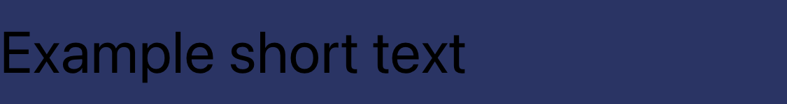
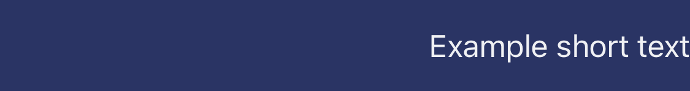
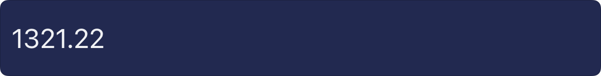
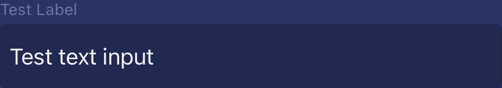
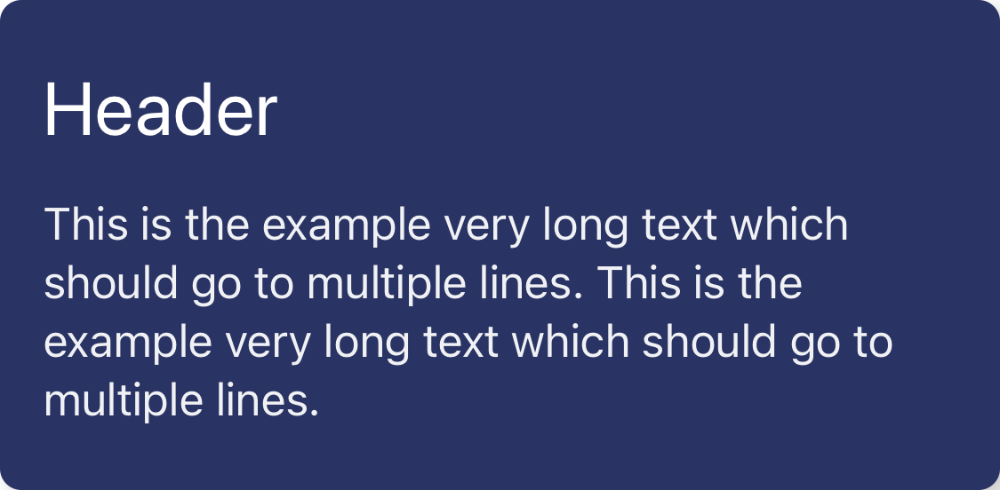
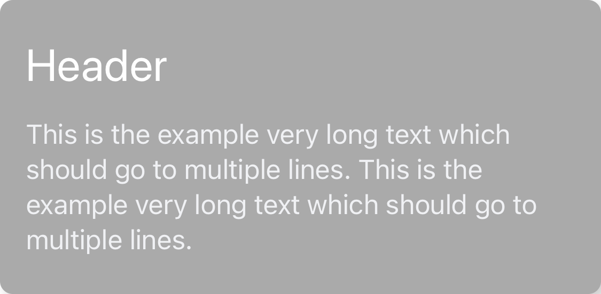
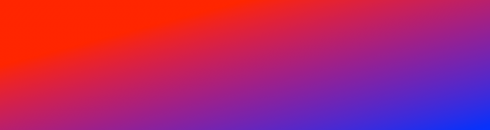
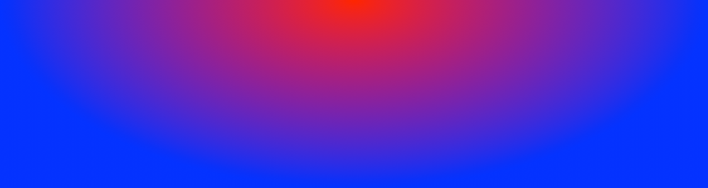
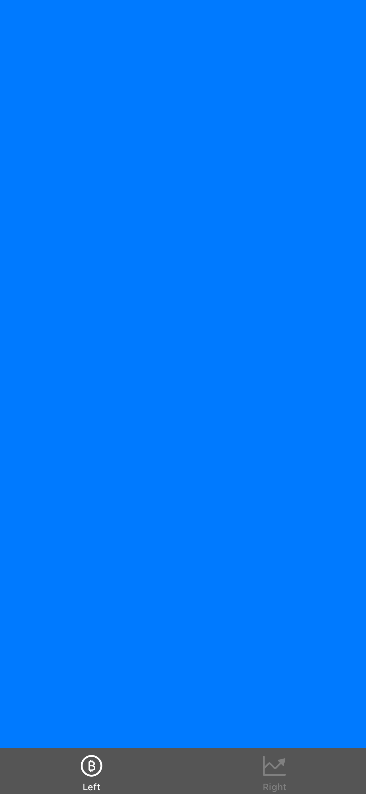

# ViewFactory

  

 

<a href="https://www.buymeacoffee.com/loosemarek" target="_blank"></a>

Swift package module used for creating basic views with [Factory Pattern](https://www.raywenderlich.com/books/design-patterns-by-tutorials/v3.0/chapters/11-factory-pattern).

`ViewFactory` includes:

- 7 different types of factories
- 4 helper classes (used for styling views)
- 2 custom views

## Content

- [Installation](#installation)
- [Usage](#usage)
- [Factories](#factories)
	- [LabelFactory](#labelfactory)
	- [InputFactory](#inputfactory)
	- [ButtonFactory](#buttonfactory)
	- [StackFactory](#stackfactory)
	- [ScrollFactory](#scrollfactory)
	- [TableFactory](#tablefactory)
	- [CardFactory](#cardfactory)
- [Extending factories](#extending-factories)
- [Helpers](#helpers)
	- [ConstraintHelper](#constrainthelper)
	- [GradientHelper](#gradienthelper)
	- [NavigationBarHelper](#navigationbarhelper)
	- [TabBarHelper](#tabbarhelper)
- [Enums](#enums)
	- [Padding](#padding)
	- [Elevation](#elevation)
- [Views](#views)
	- [BaseCell](#basecell)
	- [VerticalScrollView](#verticalscrollview)
- [Testing](#testing)
- [Author](#author)

## Installation

### Swift Package Manager

1. In Xcode go to File -> Add Package...
2. In Search or Enter Package URL paste `https://github.com/LooseMarek/ViewFactory`
3. Dependency Rule -> Version Up to Next Major -> 1.0.0 < 2.0.0
4. Add Package
5. On the pop up screen -> Add Package

## Usage

### Import module on top of your class

```
import ViewFactory
```

### Initalize ViewFactory

#### Default colors

By default `ViewFactory` is initialized with its own color palette set to dark mode (navy blue) which is based on the [WordTracker app](http://marekloose.com/wordtracker/).

<p>
    
    
</p>

You can initialize `ViewFactory` as fallow:

```
let viewFactory: ViewFactoryProtocol = ViewFactory()
```

#### Custom colors

Most likely you would like to use your own color palette. 

As usual, you can change the colors of the views by changing their color properties after initializing them, but it's recommended to define the global color palette used across an entire project.

You can do this by creating a custom ViewFactoryColor palette by implementing `ViewFactoryColorProtocol`:

```
import UIKit
import ViewFactory

class YourCustomViewFactoryColor: ViewFactoryColorProtocol {
	// ... Implement all variables
}
```

And then pass it to `ViewFactory` when initializing:

```
let yourCustomViewFactoryColor: ViewFactoryColorProtocol = YourCustomViewFactoryColor()
let viewFactory: ViewFactoryProtocol = ViewFactory(viewFactoryColor: yourCustomViewFactoryColor)
```

In this way, if you wish to e.g. change the color of all header labels, you can easily do it from `YourCustomViewFactoryColor` by changing `labelHeader` color. 

## Factories

### LabelFactory

**Important: All labels are being created with a transparent background color. Examples below are using `.card` color as the background to distinguish labels from document background (which may be white).**

##### Header

By default, the header label is set to align to the left and adjust the font size to fit the width and keep it on one line.

`let label = viewFactory.label.header()`

<p>
    
</p>

<p>
    
</p>

```
let yourCustomViewFactoryColor: ViewFactoryColorProtocol = YourCustomViewFactoryColor() // Where .labelHeader is set to .black
let viewFactory: ViewFactoryProtocol = ViewFactory(viewFactoryColor: yourCustomViewFactoryColor)
let label = viewFactory.label.header()
```

<p>
    
</p>

`let label = viewFactory.label.header(alignment: .right)`

<p>
    
</p>

`let label = viewFactory.label.header(alignment: .center)`

<p>
    
</p>

##### Body

Use for most of the body text.

By default, the body label is set to align to left and go into multiple lines.

**Note: For any fixed height labels, the text will truncate (as per the example below). If you like to expand the label based on the text length, make sure to set the height to be dynamic (e.g. by using constraints and placing it in the ScrollView).**

`let label = viewFactory.label.body()`

<p>
    
</p>

<p>
    
</p>

```
let yourCustomViewFactoryColor: ViewFactoryColorProtocol = YourCustomViewFactoryColor() // Where .labelBody is set to .blue
let viewFactory: ViewFactoryProtocol = ViewFactory(viewFactoryColor: yourCustomViewFactoryColor)
let label = viewFactory.label.body()
```

<p>
    
</p>

`let label = viewFactory.label.body(alignment: .right)`

<p>
    
</p>

`let label = viewFactory.label.body(alignment: .center)`

<p>
    
</p>

##### Input

Placed above inputs, body texts, or any other views to use as a description.

**Note: See StackFactory.labeledView() for intended usage.**

By default, the input label is set to align to the left and adjust the font size to fit the width and keep it on one line.

`let label = viewFactory.label.inputLabel()`

<p>
    
</p>

<p>
    
</p>

```
let yourCustomViewFactoryColor: ViewFactoryColorProtocol = YourCustomViewFactoryColor() // Where .labelInput is set to .brown
let viewFactory: ViewFactoryProtocol = ViewFactory(viewFactoryColor: yourCustomViewFactoryColor)
let label = viewFactory.label.inputLabel()
```

<p>
    
</p>

`let label = viewFactory.label.inputLabel(alignment: .right)`

<p>
    
</p>

`let label = viewFactory.label.inputLabel(alignment: .center)`

<p>
    
</p>

##### Hint

Use for most of the caption text (small print).

Similar to `inputLabel` but by default, the hint label is set to align to left and go into multiple lines.

**Note: For any fixed height labels, the text will truncate. If you like to expand the label based on the text length, make sure to set the height to be dynamic (e.g. by using constraints and placing it in the ScrollView).**

`let label = viewFactory.label.hint()`

<p>
    
</p>

<p>
    
</p>

```
let yourCustomViewFactoryColor: ViewFactoryColorProtocol = YourCustomViewFactoryColor() // Where .labelHint is set to .orange
let viewFactory: ViewFactoryProtocol = ViewFactory(viewFactoryColor: yourCustomViewFactoryColor)
let label = viewFactory.label.hint()
```

<p>
    
</p>

`let label = viewFactory.label.hint(alignment: .right)`

<p>
    
</p>

`let label = viewFactory.label.hint(alignment: .center)`

<p>
    
</p>

### InputFactory

**Important: All inputs are being created with the dark navy blue background color.**

By default, all inputs are set to be 48.0 height (unless the frame of the UITextField will be changed), the return key is set to "done" and the borders are rounded.

##### Number

By default, number input is changing keyboard type to number pad and adding a toolbar.

`let input = viewFactory.input.number()`

<p>
    
</p>

<p>
    
</p>

```
let yourCustomViewFactoryColor: ViewFactoryColorProtocol = YourCustomViewFactoryColor() // Where .input [background] is set to .green, .onInput is set to .black and .inputPlaceholder is set to .gray
let viewFactory: ViewFactoryProtocol = ViewFactory(viewFactoryColor: yourCustomViewFactoryColor)
let input = viewFactory.input.number()
```

<p>
    
</p>

<p>
    
</p>

##### Text

By default, text input is using the default keyboard.

`let input = viewFactory.input.text()`

<p>
    
</p>

<p>
    
</p>

```
let yourCustomViewFactoryColor: ViewFactoryColorProtocol = YourCustomViewFactoryColor() // Where .input [background] is set to .green, .onInput is set to .black and .inputPlaceholder is set to .gray
let viewFactory: ViewFactoryProtocol = ViewFactory(viewFactoryColor: yourCustomViewFactoryColor)
let input = viewFactory.input.text()
```

<p>
    
</p>

<p>
    
</p>

### ButtonFactory

##### Negative

By default, the negative button is set to be 40.0 height, and wrap text horizontally (so make sure to set either horizontal constraints or `heightAnchor` constraint). The button is also set to have borders (which are rounded and are the same color as text) and have a dark navy blue background color.

`let button = viewFactory.button.negative()`

<p>
    
</p>

```
let yourCustomViewFactoryColor: ViewFactoryColorProtocol = YourCustomViewFactoryColor() // Where .buttonNegative [background] is set to .red and .onButtonNegative is set to .white
let viewFactory: ViewFactoryProtocol = ViewFactory(viewFactoryColor: yourCustomViewFactoryColor)
let button = viewFactory.button.negative()
```

<p>
    
</p>

##### MainFab

By default, the main FAB button is set to be 40.0 in height and width, and it's intended to be used with Image only. The button is also set to be rounded and have a gradient background color.

`let button = viewFactory.button.mainFab()`

<p>
    
</p>

```
let yourCustomViewFactoryColor: ViewFactoryColorProtocol = YourCustomViewFactoryColor() // Where .buttonFabGradientFirst is set to .yellow, .buttonFabGradientLast is set to .orange and .onButtonFab is set to .white
let viewFactory: ViewFactoryProtocol = ViewFactory(viewFactoryColor: yourCustomViewFactoryColor)
let button = viewFactory.button.mainFab()
```

<p>
    
</p>

##### MiniFab

By default, the mini FAB button is set to be 32.0 in height and width, and it's intended to be used with Image only. The button is also set to be rounded and have a gradient background color.

`let button = viewFactory.button.miniFab()`

<p>
    
</p>

```
let yourCustomViewFactoryColor: ViewFactoryColorProtocol = YourCustomViewFactoryColor() // Where .buttonFabGradientFirst is set to .yellow, .buttonFabGradientLast is set to .orange and .onButtonFab is set to .white
let viewFactory: ViewFactoryProtocol = ViewFactory(viewFactoryColor: yourCustomViewFactoryColor)
let button = viewFactory.button.miniFab()
```

<p>
    
</p>

### StackFactory

**Important: None of the stack views have borders. The red border in the examples below is just for reference.**

##### Vertical

By default, the vertical stack is using `.fill` distribution and spacing views with `PaddingEnum.sixteen`.

`let stack = viewFactory.stack.vertical(views: [yellowView, greenView, orangeView])`

<p>
    
</p>

<p>
    
</p>

##### Horizontal

By default, horizontal stack is using `.fillEqually` distribution and spacing views with `PaddingEnum.sixteen`.

**Important: Even if child views will have uneven width, it will still set them to be equal. Modify `.distribution` if you'd like to change that behavior.**

`let stack = viewFactory.stack.horizontal(views: [yellowView, greenView, orangeView])`

<p>
    
</p>

##### TwoColumns

By default, two columns stack is using `.equalCentering` distribution, `.center` alignment and spacing views with `PaddingEnum.twentyFour` for each column and using `.fillEqually` distribution, `.center` alignment and spacing views with `PaddingEnum.twentyFour` for the row (main stack).

**Important: Even if child views will have uneven width, it will still set them to be equal. Modify `.distribution` if you'd like to change that behavior.**

`let stack = viewFactory.stack.twoColumns(leftColumnViews: [yellowView, greenView], leftColumnViews: [orangeView, blueView])`

<p>
    
</p>

<p>
    
</p>

##### LabeledView

By default, the labeled view stack is using `.fill` distribution and spacing views with `PaddingEnum.four`.

This stack view is intended to be used for labeling inputs or other (custom) views.

**Important: All labels from LabelFactory as well as stack views from StackFactory are being created with a transparent background color. Examples below are using `.card` color as the background of the stack view to distinguish labels from document background (which may be white).**

```
let label = viewFactory.label.inputLabel()
let input = viewFactory.input.text()
let stack = viewFactory.stack.labeledView(label: label, for view: input)
```

<p>
    
</p>

```
let label = viewFactory.label.inputLabel()
let stack = viewFactory.stack.labeledView(label: label, for view: yellowView)
```

<p>
    
</p>

### ScrollFactory

##### Vertical

`let scrollView = viewFactory.scroll.vertical()`

**See: Views - VerticalScrollView for more information.**

### TableFactory

##### Main

By default, the main table view is set to have `.clear` background, have `.none` separator, and frame `.zero`.

`let tableView = viewFactory.table.main()`

You can also use it with the frame.

`let tableView = viewFactory.table.main(frame: CGRect()) `

**See: Views - BaseCell for more information.**

##### Refresh

By default, refresh control is set to have tintColor `.tableRefresh`.

You can add it to your table like so.

```
private(set) var tableView: UITableView
private(set) var refreshControl = UIRefreshControl

init(viewFactory: ViewFactoryProtocol) {
	tableView = viewFactory.table.main()
	refreshControl = viewFactory.table.refresh()
}
```

```
override func viewDidLoad() {
	super.viewDidLoad()
	refreshControl.addTarget(self, action: #selector(self.refresh(_:)), for: .valueChanged)
}
```

```
override func viewWillAppear(_ animated: Bool) {
	super.viewWillAppear(animated)
	tableView.addSubview(refreshControl)
}
```

```
@objc func refresh(_ sender: AnyObject) {
	// Perform refresh
}
```

Don't forget to end the refreshing and reload the table once your refresh action is completed.

```
self.refreshControl.endRefreshing()
self.tableView.reloadData()
```

### CardFactory

**Important: Card is being created with the background color.**

##### Main

By default, main card is set to expand with the content. If you would like to "lock" its size, use `constraintHelper.setWidth()` or `constraintHelper.setHeight()` as needed.

```
let label1 = labelFactory.header()
let label2 = labelFactory.body()
let stack = stackFactory.vertical(views: [label1, label2])
let card = viewFactory.card.main(stack: stack)
_ = viewFactory.styleHelper.constraint.setWidth(for: card, at: 375.0)
```

<p>
    
</p>

```
let yourCustomViewFactoryColor: ViewFactoryColorProtocol = YourCustomViewFactoryColor() // Where .labelHeader is set to .black
let viewFactory: ViewFactoryProtocol = ViewFactory(viewFactoryColor: yourCustomViewFactoryColor)
let card = viewFactory.card.main(stack: stack)
```

<p>
    
</p>

## Extending factories

### ViewFactory

If you like to add any of your custom view factories, you can do that by extending `ViewFactoryProtocol`.

In this way, your custom factories would be available from your `ViewFactory` implementation as any other factory.

```
import ViewFactory

extension ViewFactoryProtocol {
    var custom: CustomViewFactoryProtocol {
        return CustomViewFactory(labelFactory: label, stackFactory: stack) // You can pass any other factories as a parameter
    }
}
```

```
let customView = viewFactory.custom.example()
```

### Child factories

You can also extend any existing factories with your custom views by extending protocols.

```
import UIKit
import ViewFactory

extension LabelFactoryProtocol {
    
    func exampleLabel() -> UILabel {
        let label = UILabel()
        // Your custom style
        
        return label
    }
}
```

```
let customLabel = viewFactory.label.exampleLabel()
```

## Helpers

All helpers are accessible over the style helper from `ViewFactory`.

```
let styleHelper = viewFactory.styleHelper
```

### ConstraintHelper

```
let constraintHelper = viewFactory.styleHelper.constraint
```

`ConstraintHelper` is used, when adding any views programmatically.

You can add the constraints between single `UIView` or multiple `UIView`s and the other `UIView` or `UILayoutGuide`. They are using `Padding` enum for spacing.

Single constraints:

- `constraintHelper.setTop(for: firstView, to: secondView, at: .four)`
- `constraintHelper.setBottom(for: firstView, to: secondView, at: .four)`
- `constraintHelper.setLeft(for: firstView, to: secondView, at: .four)`
- `constraintHelper.setRight(for: firstView, to: secondView, at: .four)`
- `constraintHelper.setBellow(for: firstView, to: secondView, at: .four)`

Directional constraints:

- `constraintHelper.setVertical(for: child, to: parent, at: .sixteen)` - will add constraint on top and bottom
- `constraintHelper.setVertical(for: [child1, child2], to: parent, at: .sixteen)` - will add constraint on top and bottom for each child
- `constraintHelper.setHorizontal(for: child, to: parent, at: .sixteen)` - will add constraint on left and right
- `constraintHelper.setHorizontal(for: [child1, child2], to: parent, at: .sixteen)` - will add constraint on left and right for each child
- `constraintHelper.setAll(for: child, to: parent, at: .sixteen)` - will add constraint on top, bottom, left and right

Stack:

The stack will set the same horizontal padding for each child's view and "wrap" each child's view with the `verticalAt` paddings.

```
try constraintHelper.setStack(for: [child1, child2], to: parent, horizontalAt: .zero, verticalAt: [.four, .twentyFour, .four])
```

Above will output with the constraints:

```
        .four
          ||
.zero = child1 = .zero
          ||
     .twentyFour
          ||
.zero = child2 = .zero
          ||
        .four
```

**Important: `setStack()` will throw an error if:**

**- there are no child views**

**- number of `verticalAt` paddings is not larger than 1 by child views count, e.g. for 2 children, there need to be 3 vertical constraints, for 3 children, 4 constraints, etc.**

Size:

`let heightConstraint = constraintHelper.setHeight(for: view, at: 52.0)`

`let widthConstraint = constraintHelper.setWidth(for: view, at: 100.0)`

Center:

`constraintHelper.setCenter(for: child, in: parent)` - will center child in parent view

### GradientHelper

```
let gradientHelper = viewFactory.styleHelper.gradient
```

Diagonal:

```
try gradientHelper.diagonal(for: view, colorTop: .red, colorBottom: .blue)
```

<p>
    
</p>

**Important: This will throw an error if a given gradient layer already exists.**

Custom (default):

```
try gradientHelper.custom(for: view, colors: [UIColor.red.cgColor, UIColor.blue.cgColor])
```

<p>
    
</p>

Custom (default):

```
try gradientHelper.custom(for: view, cornerRadius: 16.0, colors: [UIColor.red.cgColor, UIColor.blue.cgColor])
```

<p>
    
</p>

Custom (changing start/end point):

```
try gradientHelper.custom(for: view, start: .topCenter, colors: [UIColor.red.cgColor, UIColor.blue.cgColor])
```

<p>
    
</p>

```
try gradientHelper.custom(for: view, start: .center, colors: [UIColor.red.cgColor, UIColor.blue.cgColor])
```

<p>
    
</p>

Custom (changing type):

```
try gradientHelper.custom(for: view, colors: [UIColor.red.cgColor, UIColor.blue.cgColor], type: .radial)
```

<p>
    
</p>

```
try gradientHelper.custom(for: view, colors: [UIColor.red.cgColor, UIColor.blue.cgColor], type: .axial)
```

<p>
    
</p>

```
try gradientHelper.custom(for: view, colors: [UIColor.red.cgColor, UIColor.blue.cgColor], type: .conic)
```

<p>
    
</p>

### NavigationBarHelper

```
let navigationBarHelper = viewFactory.styleHelper.navigationBar
```

Use for the styling navigation bar.

By default, it's set to be transparent.

**Important: `UIViewController` must be presented with `UINavigationController` in order to see `UINavigationBar`.**

```
let viewController = UIViewController()
let navigationController = UINavigationController()
navigationController.viewControllers = [viewController]
let window = UIWindow(windowScene: scene)
window.rootViewController = navigationController
```

in your `viewDidLoad()`

```
navigationItem.leftBarButtonItem = UIBarButtonItem(barButtonSystemItem: .cancel, target: self, action: #selector(cancelClicked)) // Or any custom you like
navigationItem.rightBarButtonItem = UIBarButtonItem(barButtonSystemItem: .done, target: self, action: #selector(doneClicked)) // Or any custom you like
title = "Navbar Title"
```

In your `viewWillAppear()`

```
if let navigationBar = navigationController?.navigationBar {
    navigationBarHelper.style(navigationBar)
}
```

<p>
    
</p>

```
let yourCustomViewFactoryColor: ViewFactoryColorProtocol = YourCustomViewFactoryColor() // Where .onNavigationBar is set to .darkGray
let viewFactory: ViewFactoryProtocol = ViewFactory(viewFactoryColor: yourCustomViewFactoryColor)
```

<p>
    
</p>

### TabBarHelper

```
let tabBarHelper = viewFactory.styleHelper.tabBar
```

Use for styling tab bar.

By default, it's set to have a background.

**Important: `UIViewController` must be presented with `UITabBarController` in order to see `UINavigationBar`.**

```
let viewController = UIViewController()
let tabBarController = UITabBarController()
tabBarController.viewControllers = [viewController]
let window = UIWindow(windowScene: scene)
window.rootViewController = tabBarController
```

in your `viewDidLoad()` of `UIViewController `

```
let tabBarItem = UITabBarItem()
tabBarItem.title = "Left"
tabBarItem.image = UIImage(systemName: "bitcoinsign.circle")
viewController.tabBarItem = tabBarItem
```

In your `viewWillAppear()` of `UITabBarController`

```
tabBarHelper.style(tabBar)
```

<p>
    
</p>

```
let yourCustomViewFactoryColor: ViewFactoryColorProtocol = YourCustomViewFactoryColor() // Where .tabBar is set to .darkGray, .onTabBar is set to .gray and .onTabBarActive is set to .white
let viewFactory: ViewFactoryProtocol = ViewFactory(viewFactoryColor: yourCustomViewFactoryColor)
```

<p>
    
</p>

## Enums

### Padding

Padding is predefine dimension recommended to use in iOS apps for any padding around the views.

```
public enum Padding {
    case zero, four, eight, sixteen, twentyFour
    case custom(CGFloat)
    
    var value: CGFloat {
        switch self {
        case .zero:
          return 0
        case .four:
            return 4.0
        case .eight:
            return 8.0
        case .sixteen:
            return 16.0
        case .twentyFour:
            return 24.0
        case .custom(let customValue):
          return customValue
        }
    }
}
```

```
let definedPadding: CGFloat = Padding.four.value
```

```
let customPadding: CGFloat = Padding.custom(72.0).value
```

### Elevation

The elevation is predefined dimension recommended to use for elevating any views as per [material.io](https://material.io/design/environment/elevation.html#default-elevations).

```
public enum Elevation {
    case zeroDp, oneDp, twoDp, threeDp, fourDp, sixDp, eightDp, twelveDp, sixteenDp, twentyFourDp
    case custom(CGFloat)
    
    var value: CGFloat {
        switch self {
        case .zeroDp: // Standard side sheet, Text button, Top app bar (resting elevation)
          return 0
        case .oneDp: // Switch, Card (resting elevation), Search bar (resting elevation)
            return 1.0
        case .twoDp: // Contained button (resting elevation)
            return 2.0
        case .threeDp: // Refresh indicator Search bar (scrolled state)
            return 3.0
        case .fourDp: // Top app bar (normal or scrolled state)
            return 4.0
        case .sixDp: // Floating action button (FAB - resting elevation) Snackbar
            return 6.0
        case .eightDp: // Contained button (pressed state), Card (when picked up), Menus and sub menus, Bottom app bar, Bottom navigation bar, Standard bottom sheet Standard side sheet
            return 8.0
        case .twelveDp: // Floating action button (FAB - pressed)
            return 12.0
        case .sixteenDp: // Navigation drawer, Modal bottom sheet Modal side sheet
            return 16.0
        case .twentyFourDp: // Dialog
            return 24.0
        case .custom(let customValue):
          return customValue
        }
    }
}
```

## Views

### BaseCell

`BaseCell` is a helper `UITableViewCell` to make table view implementation easier. 

The example below shows how to use it with the MVVM pattern.

Create your ViewModel for a single cell

```
public protocol YourCellViewModelProtocol {}

class YourCellViewModel: YourCellViewModelProtocol {}
```

Create a main view class extending `BaseCellMainView`. This will be your main view of the cell (in the example below, that's a Card).

```
import ViewFactory

public class YourCard: BaseCellMainView {
    public func setStyle() {
        // Style additional views of your card (if needed)
    }
}
```

Create cell class extending `BaseCell`

```
import ViewFactory

class YourCustomCell: BaseCell {
    func setData(from yourCellViewModel: YourCellViewModelProtocol) {
        guard let yourCard = mainView as? YourCard else {
            return
        }
        
        // Map data from ViewModel to Views
    }
}
```

In your YourViewController

```
private(set) var tableView: UITableView
private(set) var yourCellViewModels: [YourCellViewModelProtocol] = []
```

In your `init()`

```
tableView = viewFactory.table.main()
tableView.register(YourCustomCell.self, forCellReuseIdentifier: YourCustomCell.identifier)
```

In your `viewDidLoad()`

```
tableView.dataSource = self
```

In your `viewWillAppear()`

```
view.addSubview(tableView)
viewFactory.styleHelper.constraint.setAll(for: tableView, to: view.safeAreaLayoutGuide, at: .zero)
yourCellViewModels = [] // Add your objects e.g. ViewModels
tableView.reloadData()
```

Implement `UITableViewDataSource` (to map ViewModels to your Cells)

```
extension YourViewController: UITableViewDataSource {

    func tableView(_ tableView: UITableView, numberOfRowsInSection section: Int) -> Int {
        yourCellViewModels.count
    }

    func tableView(_ tableView: UITableView, cellForRowAt indexPath: IndexPath) -> UITableViewCell {
        let cell: YourCustomCell = tableView.dequeueReusableCell(withIdentifier: YourCustomCell.identifier, for: indexPath) as! YourCustomCell
        let index: Int = indexPath.row
        let yourCellViewModel: YourCellViewModelProtocol = yourCellViewModels[index]
        
        let mainView = YourCard() // Must extend BaseCellMainView
        cell.initCell(with: mainView, constraintHelper: constraintHelper)
        cell.setData(from: yourCellViewModel)

        return cell
    }
}
```

**Note: `.initCell()` of `BaseCell` removes all subviews (so the cell are reused properly), sets subviews, layout (constraints between `BaseCell` and `mainView: BaseCellMainView`) and style `BaseCell` to be transparent and with selection style set to `.none`.**

### VerticalScrollView

VerticalScrollView is a helper view to make the implementation of `UIScrollView` simpler. 

You can initialize it from the `ScrollFactory`

```
private(set) var scrollView: VerticalScrollView

init(viewFactory: ViewFactoryProtocol) {
	scrollView = viewFactory.scroll.vertical()
}
```

VerticalScrollView contains only one subview `scrollPage` which fills the entire VerticalScrollView and expands vertically with the content. By default `scrollPage` is **not** added to VerticalScrollView - this is to be able to easily remove/add all subviews based on the UI state (e.g. if ViewController is recreated from `viewWillTransition`).

In your `viewWillAppear` or `viewWillTransition` call:

```
override func viewWillAppear(_ animated: Bool) {
	let horizontalPadding: CGFloat = PaddingEnum.sixteen.rawValue
	let verticalPaddings: [CGFloat] = [
		PaddingEnum.sixteen.rawValue, // Padding between top and firstView
		PaddingEnum.twentyFour.rawValue, // Padding between firstView and secondView
		PaddingEnum.twentyFour.rawValue, // Padding between secondView and thirdView
		PaddingEnum.sixteen.rawValue // Padding between thirdView and bottom
	]
	let subviewsInOrder: [UIView] = [
		firstView,
		secondView,
		thirdView
	]
    
	// Will throw error when a count of verticalPaddings won't be higher by one of the subviews count.
	try! scrollView.initSubviews(subviewsInOrder, in: view, horizontalPadding: horizontalPadding, verticalPaddings: verticalPaddings)  
}
```

## Testing

The module is run with GitHub Actions every time the new commit is pushed to the remote branch `master`. The testing includes:

- building the project
- running unit and snapshot tests

You can also do that locally by running the below commands in the terminal:

Build:

```
xcodebuild -scheme 'ViewFactory' -sdk iphonesimulator -destination 'platform=iOS Simulator,name=iPhone 11,OS=15.0' build
```

Test:

```
xcodebuild -scheme 'ViewFactory' -sdk iphonesimulator -destination 'platform=iOS Simulator,name=iPhone 11,OS=15.0' test
```

Note: The commands above are running with iPhone 11 but you can use any iOS devices you like.

### Mocks

ViewFactory module provides a set of simple mocks to help you test your app. 

The mock classes are located in the `Mocks` directory and include:

Mock Factories:

- `MockInputFactory: InputFactoryProtocol`
- `MockScrollFactory: ScrollFactoryProtocol`

Mock Helpers:

- `MockConstraintHelper: ConstraintHelperProtocol`
- `MockGradientHelper: GradientHelperProtocol`
- `MockNavigationBarHelper: NavigationBarHelperProtocol`
- `MockTabBarHelper: TabBarHelperProtocol`

Mock Views:

- `MockScrollView: ScrollView`
- `MockUITextField: UITextField`

## Author

Marek Loose
