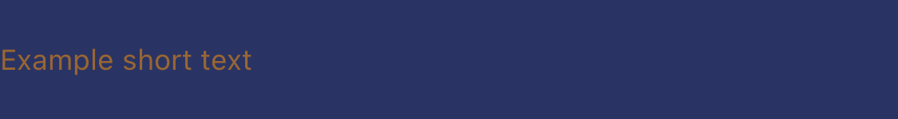

# ViewFactory

  

 

Swift package module used for creating basic views with [Factory Pattern](https://www.raywenderlich.com/books/design-patterns-by-tutorials/v3.0/chapters/11-factory-pattern).

`ViewFactory` includes:

- 7 different types of factories
- 4 helper classes (used for styling views)
- 2 custom views

## Content

- [Installation](#installation)
- [Usage](#usage)
- [Factories](#factories)
	- [LabelFactory](#labelfactory)
	- [InputFactory](#inputfactory)
	- [ButtonFactory](#buttonfactory)
	- [StackFactory](#stackfactory)
	- [ScrollFactory](#scrollfactory)
	- [TableFactory](#tablefactory)
	- [CardFactory](#cardfactory)
- [Extending factories](#extending-factories)
- [Helpers](#helpers)
	- [ConstraintHelper](#constrainthelper)
	- [GradientHelper](#gradienthelper)
	- [NavigationBarHelper](#navigationbarhelper)
	- [TabBarHelper](#tabbarhelper)
- [Views](#views)
	- [BaseCell](#basecell)
	- [ScrollView](#scrollview)
- [Testing](#testing)
- [Author](#author)

## Installation

### Swift Package Manager

1. In Xcode go to File -> Add Package...
2. In Search or Enter Package URL paste `https://github.com/LooseMarek/ViewFactory`
3. Dependency Rule -> Version Up to Next Major -> 1.0.0 < 2.0.0
4. Add Package
5. On the pop up screen -> Add Package

## Usage

### Import module on top of your class

```
import ViewFactory
```

### Initalize ViewFactory

#### Default colors

By default `ViewFactory` is initialized with its own color palette set to dark mode (navy blue) which is based on the [WordTracker app](http://marekloose.com/wordtracker/).

<p>
    
    
</p>

You can initialize `ViewFactory` as fallow:

```
let viewFactory: ViewFactoryProtocol = ViewFactory()
```

#### Custom colors

Most likely you would like to use your own color palette. 

As usual, you can change colors of the views by changing it's color properties after initializing it, but it's recommended to define global color palette used across entire project.

You can do this by creating custom ViewFactoryColor palette by implementing `ViewFactoryColorProtocol`:

```
import UIKit
import ViewFactory

class YourCustomViewFactoryColor: ViewFactoryColorProtocol {
	// ... Implement all variables
}
```

And then pass it to `ViewFactory` when initializing:

```
let yourCustomViewFactoryColor: ViewFactoryColorProtocol = YourCustomViewFactoryColor()
let viewFactory: ViewFactoryProtocol = ViewFactory(viewFactoryColor: yourCustomViewFactoryColor)
```

In this way, if you wish to e.g. change color of all header labels, you can easly do it from `YourCustomViewFactoryColor` by changing `labelHeader` color. 

## Factories

### LabelFactory

**Important: All labels are being created with transparent background color. Examples below are using `.card` color as background to distinguish labels from document background (which may be white).**

##### Header

By default, header label is set to align to left and ajdust the font size to fit width and keep it on one line.

`let label = viewFactory.label.header()`

<p>
    
</p>

<p>
    
</p>

```
let yourCustomViewFactoryColor: ViewFactoryColorProtocol = YourCustomViewFactoryColor() // Where .labelHeader is set to .black
let viewFactory: ViewFactoryProtocol = ViewFactory(viewFactoryColor: yourCustomViewFactoryColor)
let label = viewFactory.label.header()
```

<p>
    
</p>

`let label = viewFactory.label.header(alignment: .right)`

<p>
    
</p>

`let label = viewFactory.label.header(alignment: .center)`

<p>
    
</p>

##### Body

Use for most of the body text.

By default, body label is set to align to left and go into multiple lines.

**Note: For any fix height labels, the text will truncate (as per example below). If you like to expand label base on the text length, make sure to set height to be dynamic (e.g. by using constraints and placing it in the ScrollView).**

`let label = viewFactory.label.body()`

<p>
    
</p>

<p>
    
</p>

```
let yourCustomViewFactoryColor: ViewFactoryColorProtocol = YourCustomViewFactoryColor() // Where .labelBody is set to .blue
let viewFactory: ViewFactoryProtocol = ViewFactory(viewFactoryColor: yourCustomViewFactoryColor)
let label = viewFactory.label.body()
```

<p>
    
</p>

`let label = viewFactory.label.body(alignment: .right)`

<p>
    
</p>

`let label = viewFactory.label.body(alignment: .center)`

<p>
    
</p>

##### Input

Placed above inputs, body texts or any other views to use as a description.

By default, input label is set to align to left and ajdust the font size to fit width and keep it on one line.

`let label = viewFactory.label.inputLabel()`

<p>
    
</p>

<p>
    
</p>

```
let yourCustomViewFactoryColor: ViewFactoryColorProtocol = YourCustomViewFactoryColor() // Where .labelInput is set to .brown
let viewFactory: ViewFactoryProtocol = ViewFactory(viewFactoryColor: yourCustomViewFactoryColor)
let label = viewFactory.label.inputLabel()
```

<p>
    
</p>

`let label = viewFactory.label.inputLabel(alignment: .right)`

<p>
    
</p>

`let label = viewFactory.label.inputLabel(alignment: .center)`

<p>
    
</p>

##### Hint

Use for most of the caption text (small print).

Similar to `inputLabel` but by default, hint label is set to align to left and go into multiple lines.

**Note: For any fix height labels, the text will truncate. If you like to expand label base on the text length, make sure to set height to be dynamic (e.g. by using constraints and placing it in the ScrollView).**

`let label = viewFactory.label.hint()`

<p>
    
</p>

<p>
    
</p>

```
let yourCustomViewFactoryColor: ViewFactoryColorProtocol = YourCustomViewFactoryColor() // Where .labelHint is set to .orange
let viewFactory: ViewFactoryProtocol = ViewFactory(viewFactoryColor: yourCustomViewFactoryColor)
let label = viewFactory.label.hint()
```

<p>
    
</p>

`let label = viewFactory.label.hint(alignment: .right)`

<p>
    
</p>

`let label = viewFactory.label.hint(alignment: .center)`

<p>
    
</p>

### InputFactory

**Important: All inputs are being created with dark navy blue background color.**

By default, all inputs are set to be 48.0 height (unless the frame of the UITextField will be changed), return key is set to "done" and the borders are rounded.

##### Number

By default, number input is changing keyboard type to number pad and add toolbar.

`let input = viewFactory.input.number()`

<p>
    
</p>

<p>
    
</p>

```
let yourCustomViewFactoryColor: ViewFactoryColorProtocol = YourCustomViewFactoryColor() // Where .input [background] is set to .green, .onInput is set to .black and .inputPlaceholder is set to .gray
let viewFactory: ViewFactoryProtocol = ViewFactory(viewFactoryColor: yourCustomViewFactoryColor)
let input = viewFactory.input.number()
```

<p>
    
</p>

<p>
    
</p>

##### Text

By default, text input is using default keyboard.

`let input = viewFactory.input.text()`

<p>
    
</p>

<p>
    
</p>

```
let yourCustomViewFactoryColor: ViewFactoryColorProtocol = YourCustomViewFactoryColor() // Where .input [background] is set to .green, .onInput is set to .black and .inputPlaceholder is set to .gray
let viewFactory: ViewFactoryProtocol = ViewFactory(viewFactoryColor: yourCustomViewFactoryColor)
let input = viewFactory.input.text()
```

<p>
    
</p>

<p>
    
</p>

### ButtonFactory

##### Negative

By default, negative button is set to be 40.0 height, and wrap text horizontally (so make sure to set either horizontal constraints or `heightAnchor` constraint). The button is also set to have borders (which are rounded and are the same color as text) and have dark navy blue background color.

`let button = viewFactory.button.negative()`

<p>
    
</p>

```
let yourCustomViewFactoryColor: ViewFactoryColorProtocol = YourCustomViewFactoryColor() // Where .buttonNegative [background] is set to .red and .onButtonNegative is set to .white
let viewFactory: ViewFactoryProtocol = ViewFactory(viewFactoryColor: yourCustomViewFactoryColor)
let button = viewFactory.button.negative()
```

<p>
    
</p>

##### MainFab

By default, main FAB button is set to be 40.0 height and width, and it's intended to be used with Image only. The button is also set to be rounded and have gradient background color.

`let button = viewFactory.button.mainFab()`

<p>
    
</p>

```
let yourCustomViewFactoryColor: ViewFactoryColorProtocol = YourCustomViewFactoryColor() // Where .buttonFabGradientFirst is set to .yellow, .buttonFabGradientLast is set to .orange and .onButtonFab is set to .white
let viewFactory: ViewFactoryProtocol = ViewFactory(viewFactoryColor: yourCustomViewFactoryColor)
let button = viewFactory.button.mainFab()
```

<p>
    
</p>

##### MiniFab

By default, mini FAB button is set to be 32.0 height and width, and it's intended to be used with Image only. The button is also set to be rounded and have gradient background color.

`let button = viewFactory.button.miniFab()`

<p>
    
</p>

```
let yourCustomViewFactoryColor: ViewFactoryColorProtocol = YourCustomViewFactoryColor() // Where .buttonFabGradientFirst is set to .yellow, .buttonFabGradientLast is set to .orange and .onButtonFab is set to .white
let viewFactory: ViewFactoryProtocol = ViewFactory(viewFactoryColor: yourCustomViewFactoryColor)
let button = viewFactory.button.miniFab()
```

<p>
    
</p>

### StackFactory

**Important: None of stack views have borders. The red border in examples below are just for the reference.**

##### MainVertical

By default, main vertical stack is using `.fill` distribution and spacing views with `PaddingEnum.sixteen`.

`let stack = viewFactory.stack.mainVertical(views: [yellowView, greenView, orangeView])`

<p>
    
</p>

<p>
    
</p>

`TODO`

### ScrollFactory

`TODO`

### TableFactory

`TODO`

### CardFactory

`TODO`


## Extending factories

### ViewFactory

`TODO`

### Child factories

`TODO`

## Helpers

### ConstraintHelper

`TODO`

### GradientHelper

`TODO`

### NavigationBarHelper

`TODO`

### TabBarHelper

`TODO`


## Views

### BaseCell

`TODO`

### ScrollView

`TODO`

## Testing

Module is run with GitHub Actions everytime the new commit is pushed to the remote branch `master`. The testing includes:

- building the project
- running unit and snapshot tests

You can also do that locally by running below commands in terminal:

Build:

```
xcodebuild -scheme 'ViewFactory' -sdk iphonesimulator -destination 'platform=iOS Simulator,name=iPhone 11,OS=15.0' build
```

Test:

```
xcodebuild -scheme 'ViewFactory' -sdk iphonesimulator -destination 'platform=iOS Simulator,name=iPhone 11,OS=15.0' test
```

Note: The commands above are running with iPhone 11 but you can use any iOS devices you like.

### Mocks

ViewFactory module provides set of simple mocks to help you test your app. 

The mock classes are located in `Mocks` directory and include:

Mock Factories:

- `MockInputFactory: InputFactoryProtocol`
- `MockScrollFactory: ScrollFactoryProtocol`

Mock Helpers:

- `MockConstraintHelper: ConstraintHelperProtocol`
- `MockGradientHelper: GradientHelperProtocol`
- `MockNavigationBarHelper: NavigationBarHelperProtocol`
- `MockTabBarHelper: TabBarHelperProtocol`

Mock Views:

- `MockScrollView: ScrollView`
- `MockUITextField: UITextField`

## Author

Marek Loose